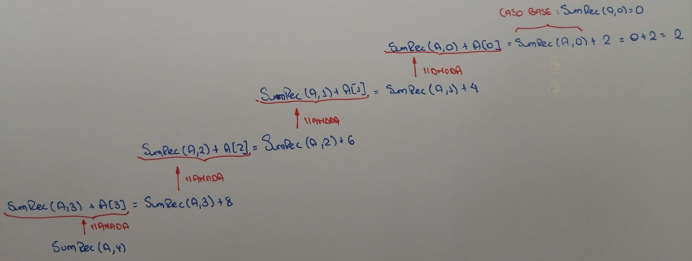
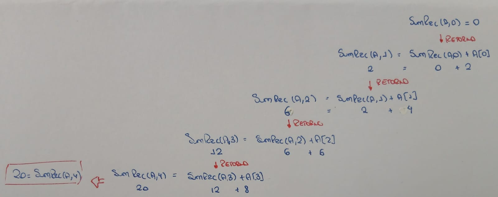
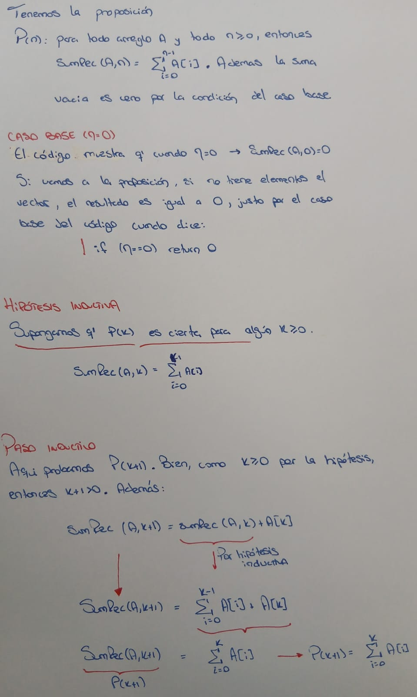
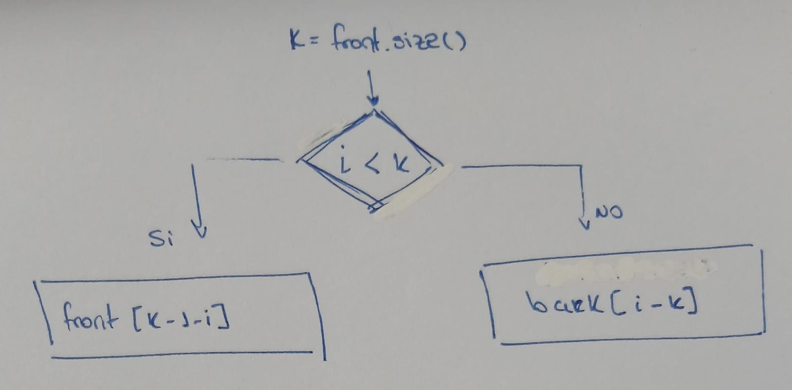
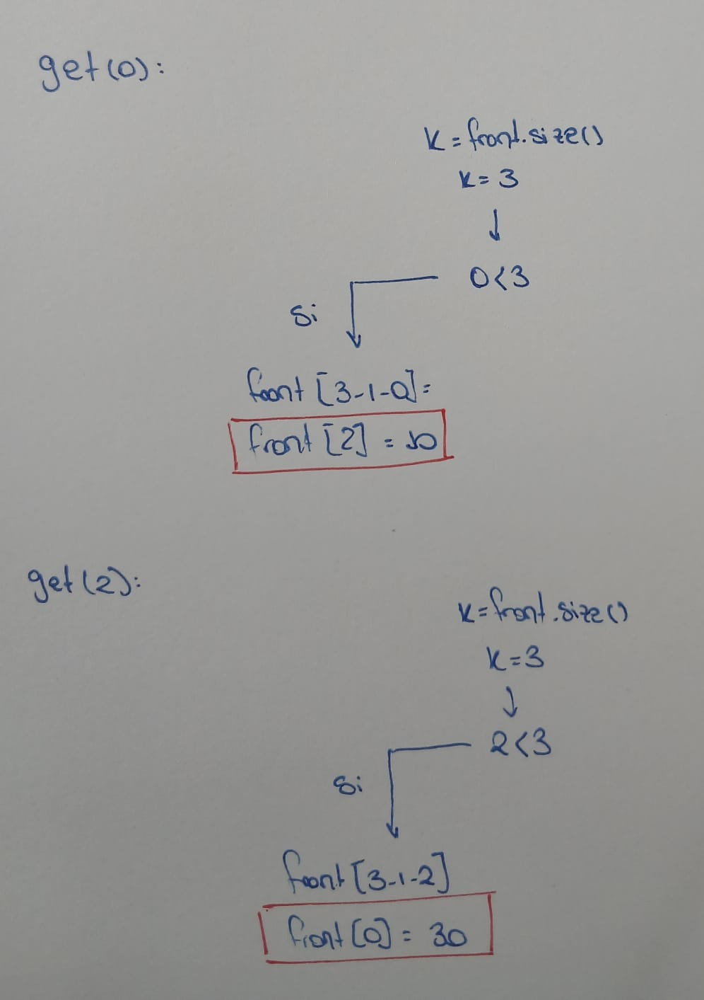
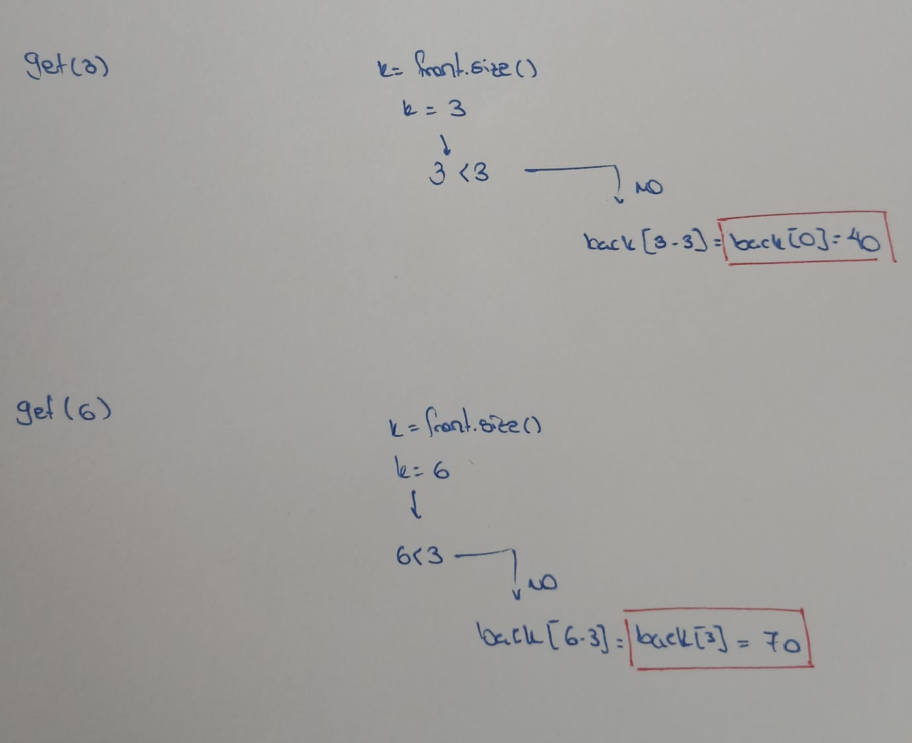

# Evaluacion Parcial

## Pregunta 1
Se desea implementar el ADT IndexedBag<T>, una colección que permite repetidos y mantiene un orden interno observable por índice:

```c++
template<class T>
class IndexedBag {
    public:
        int size() const;
        void add(T x);
        T get(int i) const;             // agrega al final lógico
        bool constains(T x) const;
        bool removeOne(T x);            // elimina una ocurrencia si existe
        void uniqueSatble();            // elimina duplicados conservando primera aparición
} 
```

Compare tres posibles representaciones: ArrayStack, RootishArrayStack y SLList.

**a)** Distinga ADT, representación e implementación usando este ejemplo.

**b)** Complete y justifique costos para add, get, constains y remove One en las tres representaciones.

**c)** Explique qué trade-off espacial introduce RootisArrayStack frente a ArrayStack.

**d)** Indique qué operación es más incómoda para SLList y por qué.

**e)** Diseñe a alto nivel uniqueStable() y analice su costo si no se permite usar tablas hash ni estructuras externas no vistas

## Pregunta 2
Considere la función recursiva que suma un arreglo:

```c++
int sumRec(const int A[], int n) {
    if (n == 0) return 0;
    return sumRec(A, n-1) + A[n-1];
}
```
**a)** Trace sumRec([2,4,6,8],4) mostrando llamadas y retornos.

Tenemos A = [2, 4, 6, 8]

Aqui muestro las llamadas



Y, aqui muestro los retornos



**b)** Pruebe correctitud por inducción sobre *n*.



Entonces, por el principio de inducción matemática, P(n) es verdadera para todo n >= 0. Por lo tanto, sumRec es correcta. 

**c)** Analice tiempo y espacio adicional. Distinga memoria del arreglo y pila de llamadas.

En cuanto al análisis de tiempo, este será O(1) dado que va a recorrer todo el arreglo para hallar la suma total, Por medio de la recursión se irá llamando elemento por elemento y recorrerá los "n" elementos.

Por otro lado, en cuando al espacio, es O(n) porque es un vector de n elementos en memoria. Cabe aclarar que esto es memoria de entrada del arreglo; no es espacio adicional que la función consuma. Podemos ver en el código incial que el arreglo se pasa como puntero (const int A[]) asi que no se copia, es decir, la función no declara estructuras nuevas, solo usa las variables locales del marco de pila (A y n) y esto da como espacio adicional tan solo O(1).

En cuanto a la distinción, la memoria del arreglo es tal cual, el almacenamiento del arreglo con el que trabajaremos mientras que la pila de llamadas se refiere a cuando hacemos las llamadas recursivas, estas se mantienen activas hasta llegar al caso base, como son n elementos, se levantarán n llamadas, por lo que es O(n).

**d)** Escriba una versión iterativa equivalente y proponga una invariante del ciclo.

Aquí tenemos una versión iterativa:
```cpp
int sumIterativa(const int A[], int n) {
    int suma = 0;
    for (int i = 0; i < n; i++) {
        suma = suma + A[i];
    }
    return suma;
}
```

La invariante de ciclo sería que siempre se cumple que la variable "suma" contiene la suma de los primeros i elementos del vector, teniendo en cuenta que si i = 0, la suma es nula, 0. 

**e)** Explique por qué pasar const int A[] comunica una intención útil para correctitud.

El "const" declara que la función no va a modificar los elementos del array, el compilador hace cumplor que la función no modifica el arreglo y eso comunica una intención útil de correctitud porque el array va a quedar intacto, no cambia entre llamadas recursivas e iteraciones. 

**f)** Indique dos casos borde y cómo deberían probarse.

Un caso borde sería el arreglo vacío, es decir cuando n = 0.
SumRec(A, 0) debería de retornar 0. Es el caso base. Y es importante porque si aquí hay un mal retorno entonces todas las llamadas al estar vinculadas, darán una falsa respuesta.

Otro caso borde es tomar un arreglo de un solo elemento, es decir cuando n = 1. Este caso borde es importante porque es la transición mínima, entre el caso base y todo lo recursivo.

## Pregunta 3
Un RootishArrayStack usa bloques de tamaños 1,2,3,...,r. Con *r* bloques, la capacidad total es *r(r+1)/2*

**a)** Para *r = 5*, dibuje los bloques y ubique los índices lógicos 0 a 14.

**b)** Para los índices i = 0, 1, 2, 5, 9, 14, indique el bloque y el desplazamiento dentro del bloque.

**c)** Explique por qué se necesita una función i2b(i) o locate(i).

**d)** Justifique por qué el espacio desperdiciado en $O(\sqrt{n})$ cuando hay *n* elementos.

**e)** Compare el acceso por índice con ArrayStack. ¿Qué se conserva y qué costo adicional aparece?

**f)** Explique qué ocurre cuando se necesita crecer o reducir el número de bloques.

## Pregunta 4
Se tiene un DualArrayDeque implementando con dos ArrayStack: front guarda la primera mitad en orden inverso y back guarda la segunda mitad en orden normal. La secuencia lógica se obtiene leyendo front de atrás hacia adelante y luego back de adelante hacia atrás.
Inicialmente: front = [30, 20, 10] y back = [40, 50, 60, 70]. Por tanto, la secuencia lógica es [10, 20, 30, 40, 50, 60, 70].

**a)** Muestre cómo se calcula get(i) para *i = 0, 2, 3, 6*.

Tengo el front = [30, 20, 10] y el back = [40, 50, 60, 70].
Para saber en que arreglo buscar, tengo que comparar el indice que deseo con el size del front, porque si el índice que deseo (del arreglo total) es menor al tamaño del front (Este es el primer array por donde se recorre), entonces solamente debo de buscar en ese arreglo, sino, es decir, si mi índice que quiero buscar es mayor al tamaño del array front, entonces debo de buscar en el arreglo back.

El algoritmo iria de la siguiente manera:



Y ahora tenemos los casos cuando i = 0, 2



Y ahora tenemos los casos cuando i = 3, 6



**b)** Ejecute add(1, 15) y add(6, 55) indicando en cuál arreglo se inserta y cómo cambia la representación.

**c)** Explique por qué front guarda su contenido en orden inverso.

En un deque debe ser fácil acceder en ambos extremos. El extremo izquierdo corresponde a trabajar sobre el front, es decir en este extremo debemos poder hacer operaciones como insertar o eliminar en O(1). Ahora, tambien sabemos que agregar o quitar al final del arreglo es O(1), a diferencia de insertar o eliminar al inicio del arreglo que cuesta O(n) porque implica desplazar todos los elementos. Y entonces, imaginemos que guardamos el array front en su orden normal, tendríamos [10, 20, 30], en este caso modificar del lado que nos interesa que es del lado del 10, del extremo izquierdo, es muy costoso; pero en cambio si lo colocamos en el orden inversos, entonces tendríamos el array [30, 20, 10], aquí ya si modificamos del lado del 10, es mucho más rápido en O(1), este es O(1) amortizado dado que se redimensiona ocacionalmente.

**d)** Defina una condición razonable de balance entre front y back. Explique qué debe hacer balance() cuando se viola.


**e)** Justifique que el rebalanceo puede mantener costos amortizados aceptables si no ocurre en cada operación.

## Pregunta 5
Una SEList almacena elementos en bloques, donde cada bloque se comporta como un pequeño deque basado en arreglos. La intención es combinar acceso por bloques, inserciones locales y menor desperdicio de espacio que algunos arreglos dinámicos.

**a)** Explique la idea de representación de SEList y cómo difiere de una DLList simple.


**b)** Indique qué invariante debería cumplirse sobre el tamaño de los bloques, salvo quizá en extremos.

**c)** Describa qué ocurre al insertar en un bloque lleno: búsqueda de espacio, desplazamiento entre bloques o creación de bloque nuevo.

**d)** Compare SEList con ArrayDeque para muchas inserciones cerca del centro.

**e)** Explique por qué la interfaz puede parecer la de una lista aunque internamente use arreglos pequeños.

**f)** Proponga una prueba de estrés que detecte errores de tamaño lógico o pérdida de elementos.

## Pregunta 6
Un estudiante entrega una implementación de ArrayDeque : : remove( i ) que pasa las pruebas públicas, pero falla en pruebas internas cuando hay wrap-around y cuando se elimina el primer o último elemento.

**a)** Proponga 4 pruebas concretas que probablemente fallen si no se maneja correctamente el wrap - around.

**b)** Proponga 2 pruebas para eliminación en estructura de tamaño 1 y tamaño 2.

**c)** Explique por qué pasar pruebas públicas no prueba correctitud total.

**d)** Indique qué invariante debería revisarse después de cada eliminación.

**e)** Explique qué tipo de error podría detectar ASan en una implementación incorrecta y qué tipo de error lógico no detectaría.

## Pregunta 7
Se desea mantener un historial de operaciones con soporte para deshacer. La estructura debe ofrecer:

apply( x ),  undo(  ), current(  ), size(  ), clear(  )

Cada apply( x ) agrega un nuevo estado al final. undo(  ) vuelve al estado anterior. current(  ) retorna el estado actual.

**a)** Defina el ADT con precondiciones y comportamiento observable.

**b)** Proponga dos representaciones: una basada en arreglo dinámico y otra basada en lista enlazada. Indique sus invariantes.

**c)** Compare costos de apply, undo, current y clear.

**d)** Explique cómo manejaría el caso de deshacer hasta quedar sin estado previo.

**e)** Proponga pruebas para secuencias largas, estados repetidos y operaciones inválidas.

**f)** Suponga que ahora se pide consultar cualquier estado por índice. Reevalúe su elección de estructura y justifique.
